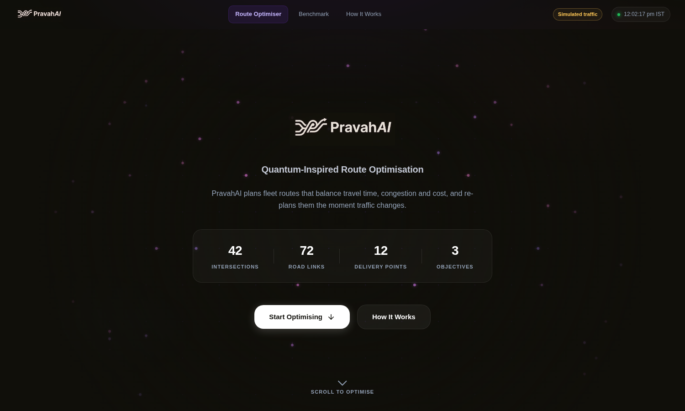
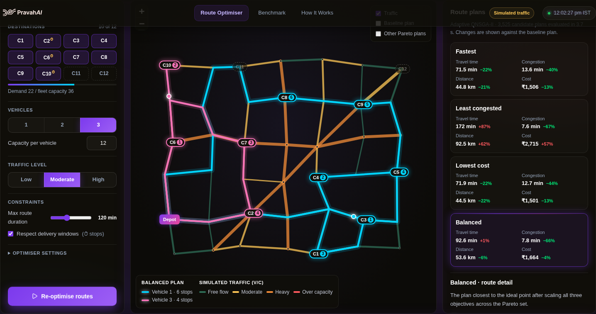
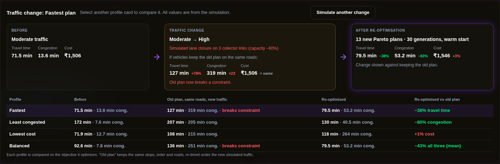
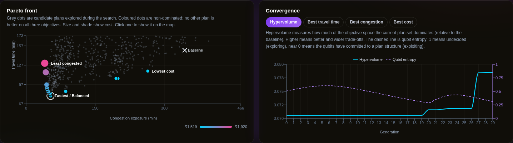

<div align="center">

# PravahAI · Route Optimizer

**Quantum-inspired multi-objective route optimisation for delivery fleets under changing traffic.**

Smart India Hackathon · Problem **SIH26137** · Round 2 prototype

[**Live demo →**](https://pravahq.vercel.app) · [API](https://pravahq-api.vercel.app/docs) · [How it works](https://pravahq.vercel.app/method) · [Benchmark](https://pravahq.vercel.app/benchmark)



</div>

---

## The problem

A depot dispatches a small fleet to a dozen delivery points across a city. There is no single
best plan, because the goals genuinely conflict:

- the **fastest** routes ride busy arterials,
- the **calmest** routes take longer side streets,
- the **cheapest** plan dispatches fewer vehicles and drives fewer kilometres.

Conventional dispatch software picks one answer and hides the trade-off. Worse, the moment a
lane closes the plan is stale and nobody can tell by how much.

**PravahAI returns the trade-off itself**: a Pareto set of route plans, each measured against a
conventional dispatch plan, drawn on a map, and re-planned when traffic changes.

## What it does

| | |
|---|---|
| **Takes** | A road network, traffic level, delivery points with demand and time windows, fleet size and capacity, and a maximum route duration |
| **Optimises** | Travel time, congestion exposure and operating cost, as three separate objectives that are never merged into one score |
| **Returns** | Every non-dominated plan, with four highlighted: **Fastest**, **Least congested**, **Lowest cost** and **Balanced** |
| **Proves** | Each plan's improvement against a traffic-unaware nearest-neighbour baseline, computed, never hard-coded |
| **Re-plans** | On a traffic change it shows what keeping the old plan costs, then re-optimises from the current qubit population |



## The demo in 60 seconds

1. **Load demo network** — a depot and 12 delivery points on a synthetic 42-intersection city grid.
2. Set stops, vehicles, capacity, traffic level and the maximum route duration. Stops can also be toggled by clicking them on the map.
3. **Optimise routes** — Adaptive QNSGA-II explores a few thousand candidate plans in about 1.5 s.
4. Click **Fastest**, **Least congested** and **Balanced** — a different route draws on the map each time, with the trade-off visible in the numbers.
5. **Simulate traffic change** — traffic rises a level and lanes close on the corridor the current plans use most.

That last step is the one to watch. Keeping the old plan on the same roads costs **+78% travel
time**; re-optimising with a warm start recovers most of it.



The search is not a black box either. The Pareto front shows every candidate explored, and the
convergence chart tracks both solution quality and **qubit entropy** — how undecided the quantum
registers still are.



---

## How it works

### Network and traffic

A seeded synthetic grid: 42 intersections, 72 roads, each with a length, lane count, capacity
(800–3,600 veh/h) and free-flow speed (28–50 km/h) by road class. Traffic level scales each
road's volume/capacity ratio, and travel time follows the standard BPR link model:

```
t = t₀ × (1 + 0.15 × (v/c)⁴)
```

An incident cuts capacity to 40% on selected roads. Same seed, same network, every time.

### Route encoding

The genotype never contains road edges. Each destination carries **12 bits**:

```
[ priority : 6 ][ vehicle : 4 ][ path policy : 2 ]
```

Decoding sorts each vehicle's stops by priority — `Depot → C3 → C1 → C5 → Depot` — and Dijkstra
supplies the road path between consecutive stops under the chosen policy (fastest,
low-congestion, shortest or balanced). Both algorithms share this decoder, so benchmarks compare
like with like.

### Adaptive QNSGA-II

Each candidate is a register of qubits stored as an angle θ, with α = cos θ and β = sin θ, so
|α|² + |β|² = 1 holds by construction. Per generation:

1. **Measure** every qubit — bit = 1 with probability |β|².
2. **Decode and repair** into a route plan; overloaded vehicles hand stops to vehicles with slack.
3. **Evaluate** three objectives plus constraint violation.
4. **Select** survivors by constrained non-dominated sorting and crowding distance.
5. **Rotate** each register toward its attractor plan, re-drawn periodically from the Pareto archive so attractors spread along the front.
6. **Local search** (2-opt, swap, relocate) on elite plans, accepted only if nothing gets worse.
7. **Quantum NOT mutation** on a few qubits.

What makes it *adaptive*: the rotation step grows from 0.02π to 0.06π across the run — small steps
early keep probabilities near 50/50 (exploration), larger steps later commit to good structures
(exploitation). If qubit entropy or plan diversity collapses, part of the population is rotated
back toward superposition. θ is clamped away from 0 and π/2, so no qubit ever becomes certain.

> It runs on ordinary hardware. "Quantum-inspired" refers to the probabilistic representation and
> the rotation update. There is no quantum hardware and no speed-up claim.

### Objectives and constraints

| Objective (all minimised, never merged) | |
|---|---|
| **Travel time** | Total traffic-adjusted driving minutes across the fleet |
| **Congestion exposure** | Minutes on congested roads weighted by severity: zero below v/c 0.6, full weight at capacity |
| **Operating cost** | ₹18/km plus ₹350 per vehicle dispatched (illustrative model) |

| Constraint | Handling |
|---|---|
| Fleet size, depot start/end, valid road paths | Guaranteed by the encoding and Dijkstra |
| Vehicle capacity | Repair by cheapest insertion into a vehicle with slack, then penalty |
| Max route duration, delivery time windows | Constrained domination (Deb's rules): any feasible plan outranks any infeasible one |

### Re-optimisation

`POST /api/traffic-change` raises the traffic level and closes lanes on the three most-used links
(capacity −60%), then:

- re-evaluates the old plans **on exactly the roads they used**, under the new traffic;
- re-optimises with a **warm start** — the archive is re-evaluated and qubit amplitudes relax 35% toward superposition so the search can explore again.

---

## Results (prototype experiment)

10 stops, 3 vehicles, moderate traffic, population 40, no local search, identical seeds and
evaluation budget for both algorithms.

| Budget | Adaptive QNSGA-II | NSGA-II (classical) |
|---|---|---|
| 60 generations · 2,400 evaluations · 5 seeds | ~0.88–0.90 × NSGA-II hypervolume | reference |
| 150 generations · 6,000 evaluations · 3 seeds | **2.430** | **2.433** |

**On this instance QNSGA-II converges more slowly and reaches parity at the larger budget.** We do
not claim it is better. Reproduce it yourself on the [Benchmark page](https://pravahq.vercel.app/benchmark)
or via `POST /api/benchmark` — the comparison runs live, with the same seeds.

---

## Run it locally

Requirements: Python 3.10+ and Node 18+. No API keys, no external services.

```bash
# Backend → http://localhost:8000 (docs at /docs)
cd backend
pip install -r requirements-dev.txt     # requirements.txt is runtime-only, used by Vercel
uvicorn api.main:app --reload --port 8000

# Frontend → http://localhost:5173
cd frontend
npm install
npm run dev
```

Set `VITE_API_URL` if the backend is not on `http://localhost:8000`.

```bash
python -m pytest tests -q       # 23 tests: engine + API
```

**Deploying:** [docs/DEPLOY.md](docs/DEPLOY.md) — two Vercel projects, free tier, about 15 minutes.

---

## Architecture

```
backend/
  network/        deterministic synthetic road graph (seed 42)
  traffic/        traffic levels, BPR travel times, simulated lane closures
  routing/        problem definition + Dijkstra leg tables per path policy
  constraints/    capacity repair, feasibility checks
  evaluation/     3 objectives, constrained domination, NDS, crowding, exact 3-D hypervolume
  optimization/
    encoding.py     12-bit genotype ↔ route plan (shared by every algorithm)
    base.py         Optimizer interface, registry, shared machinery
    qnsga2/         Adaptive Quantum-Inspired NSGA-II
    nsga2/          classical binary NSGA-II (benchmark reference)
    local_search.py 2-opt / swap / relocate, feasibility-preserving
    baseline.py     traffic-unaware nearest-neighbour reference plan
  api/            FastAPI app, request schemas, service layer
  data/           export_demo.py → demo_network_seed42.json
frontend/
  src/api/        typed API client (every server call lives here)
  src/hooks/      useOptimizer: workflow state
  src/components/ map/ · charts/ · dashboard/ · layout/
  src/pages/      Optimizer · Benchmark · How it works
tests/            engine and API tests
docs/             API.md · DEPLOY.md · MIGRATION.md
```

The optimiser is independent of the UI and the API:

```python
registry.get("qnsga2").run(problem, params, norm)
```

Adding an algorithm means implementing one `run()` method; it then works in the app and the
benchmark automatically.

### API

| Endpoint | Purpose |
|---|---|
| `GET /api/network` | Demo road network: nodes, roads, depot, destinations |
| `GET /api/traffic` | Per-road simulated state (v/c, travel time, congestion band) |
| `POST /api/optimize` | Run an optimiser; returns the Pareto set, profiles, baseline and history |
| `POST /api/traffic-change` | Escalate traffic + incident, then re-optimise with a warm start |
| `POST /api/benchmark` | QNSGA-II vs NSGA-II on identical instances, budgets and seeds |

Full reference: [docs/API.md](docs/API.md) · live schema at [`/docs`](https://pravahq-api.vercel.app/docs)

---

## What this prototype does not do

We would rather state these than have them discovered:

- The network, traffic and cost model are **synthetic and simulated**. No number here is a real-world measurement.
- Traffic is static within a run (no time-of-day dynamics) and roads are symmetric.
- The fleet is capped at 3 vehicles and the 12 demo destinations.
- QNSGA-II has **not** been shown to beat classical NSGA-II on this instance; it reaches parity at a larger budget.
- QPSO, QIGA, APSO and HGS are planned comparisons. The interface is ready; they are not implemented, and the app says so rather than showing empty charts.
- Runs are held in memory, last 30, single-user. On serverless hosting the client re-sends the scenario so a lost run is rebuilt deterministically.

## Roadmap

- A permutation-native quantum encoding, the most likely route to closing the convergence gap
- The remaining benchmark algorithms (QPSO, QIGA, APSO, HGS)
- Real road networks via OpenStreetMap, and time-varying traffic profiles
- Asymmetric roads (one-way streets, turn penalties)
